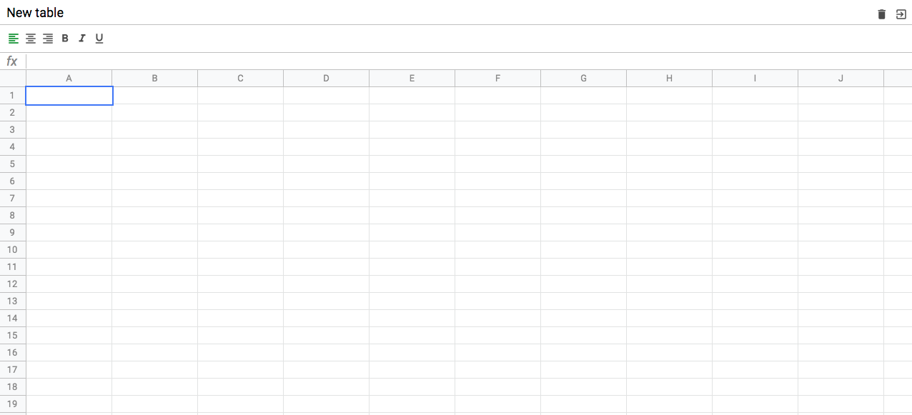

# simple js excel



## Project setup
```
npm install
```

### Tests
```
npm run test
```

### Compiles and hot-reloads for development
```
npm run start
```

### Compiles and minifies for production
```
npm run build
```

### Lints and fixes files
```
npm run lint
```